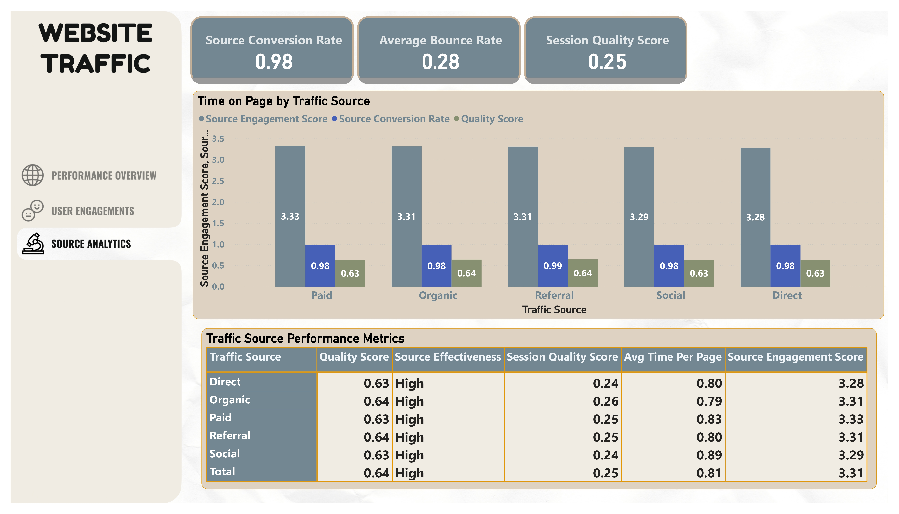

# Website Traffic Analysis Project

## Project Overview
This project conducts an in-depth analysis of website traffic data, leveraging advanced SQL data cleaning, DAX calculations in Power BI, and comprehensive performance insights.

*Dashboard overview showing key performance metrics including conversion rates, session duration, and bounce rates*

## Table of Contents
- [Data Cleaning](#data-cleaning)
- [Data Quality Tests](#data-quality-tests)
- [Power BI Analysis](#View-the-Dashboard-Here)
- [Key Insights](#key-insights)
- [Technical Methodology](#technical-methodology)

## Data Sources
- **Dataset**: Website Traffic Dataset
- **Total Records**: 11 initial rows (expanded during analysis)
- **Key Metrics**: Page Views, Session Duration, Bounce Rate, Traffic Source, Time on Page, Previous Visits, Conversion Rate

*Visualization of user engagement patterns across different traffic sources*

## Technical Methodology

### SQL Data Preparation
- Used Common Table Expressions (CTEs) for data analysis
- Created a cleaned view `view_website_traffic_dataset`
- Implemented robust data quality checks

### Power BI & DAX Analysis
Advanced calculations included:
- Traffic Source Analysis
- Engagement Metrics
- Previous Visits Impact
- Combined Performance Measures

*Detailed breakdown of traffic source performance and conversion metrics*

**[View the Dashboard Here](https://link-to-your-powerbi-dashboard.com)**

## Key Insights

### Traffic Source Performance
1. **Organic Traffic**: 
   - Highest page views (3,950)
   - Longest session duration (2,439.90)
   - Highest total conversion rate (772.07)

2. **Paid Traffic**:
   - Second-highest page views (2,116)
   - Strong engagement metrics
   - Highest source engagement score (3.33)

### Visitor Behavior
- Average Conversion Rate: 0.98%
- Return Visitor Conversion: 0.97%
- New Visitor Conversion: 0.02%
- Session Quality Score ranges: 0.243 - 0.256

## Recommendations
1. **Channel Optimization**
   - Invest more in organic traffic channels
   - Improve conversion strategies for new visitors
   - Leverage high-performing traffic sources

2. **Engagement Improvements**
   - Reduce bounce rates
   - Enhance time-on-page for lower-performing sources
   - Develop targeted content for different traffic sources

## Tools & Technologies
- SQL Server
- Power BI
- DAX
- Data Analysis
- Performance Metrics Calculation

## Links
- [HNG Internship](https://hng.tech/internship)
- [Data Analyst Opportunities](https://hng.tech/hire/data-analysts)

## Contact
[Your Name]
[Your Email/LinkedIn]
